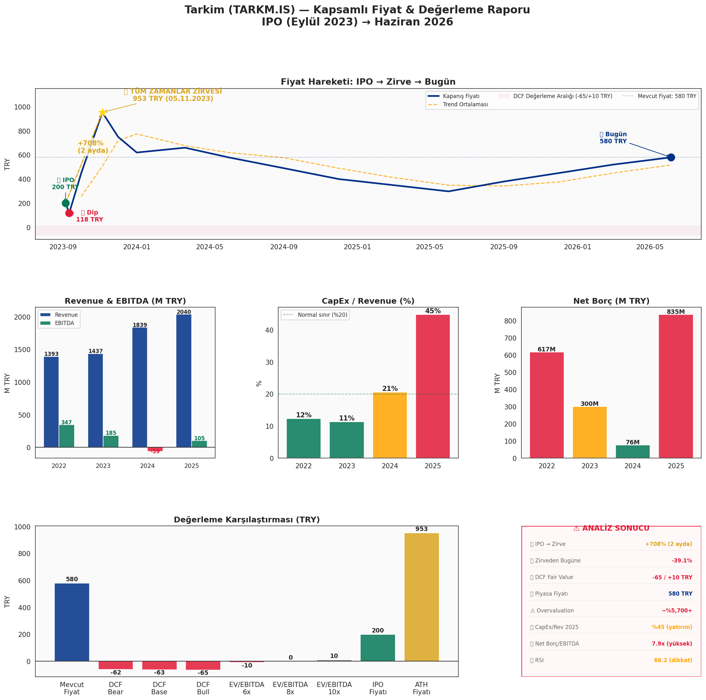
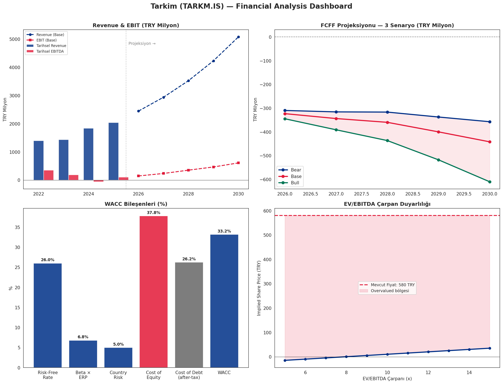
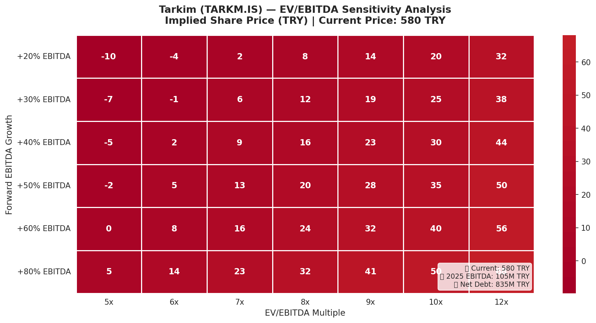
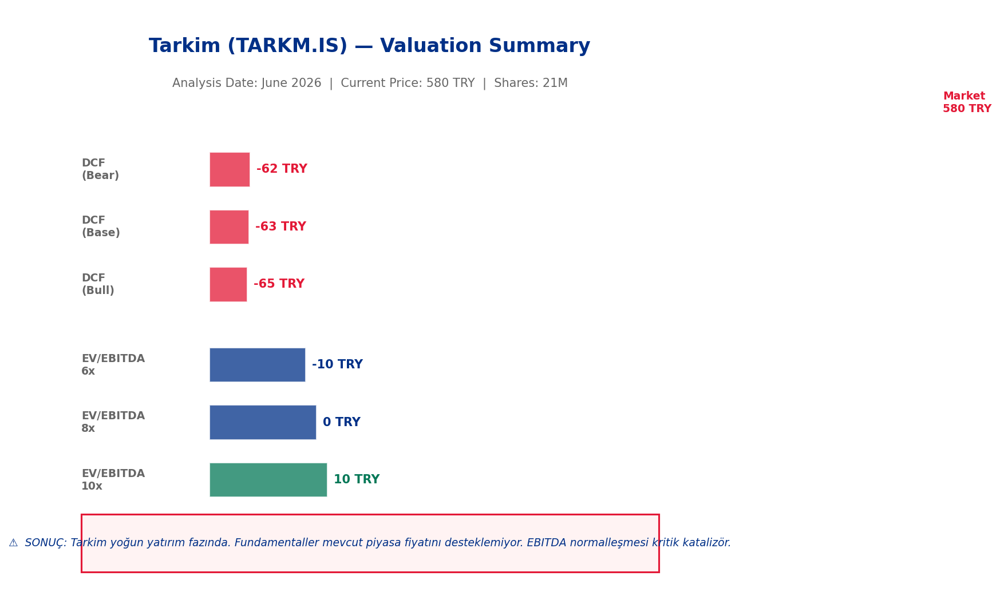

# 📊 Tarkim (TARKM.IS) — DCF & EV/EBITDA Valuation Analysis

> Comprehensive financial modeling and valuation analysis of Tarkim Bitki Koruma (BIST: TARKM) including DCF, EV/EBITDA multiples, sensitivity analysis, and historical price evaluation.

   

---

## 📌 Project Overview

This project performs a full-scale valuation of **Tarkim Bitki Koruma A.Ş.** (BIST: TARKM), a Turkish agricultural chemicals company listed on Borsa Istanbul. The analysis covers the period from IPO (September 2023) through June 2026, combining fundamental financial modeling with technical price analysis.

**Key Questions:**
- What is Tarkim's intrinsic value based on DCF and EV/EBITDA methodologies?
- Does the current market price reflect fundamental value?
- What are the key risks and catalysts for re-rating?

---

## 🔍 Key Findings

| Finding | Detail |
|---|---|
| 📈 IPO → ATH Return | **+708%** in 2 months (118 → 953 TRY) |
| 📉 ATH → Today | **-39%** (953 → 580 TRY) |
| 🎯 DCF Fair Value | **-65 / +10 TRY** (all scenarios) |
| 📊 EV/EBITDA Bull (10x) | **10 TRY** |
| ⚠️ Overvaluation vs DCF | **~5,700%+** premium to intrinsic value |
| 💳 Net Debt / EBITDA | **7.9x** (elevated) |
| 🏗️ CapEx / Revenue 2025 | **45%** (heavy investment phase) |

---

## 💡 Investment Thesis

> Tarkim is in a **heavy investment phase**. Negative DCF output is not a failure signal — it is the mathematical consequence of elevated CapEx (913M TRY in 2025) and working capital pressure. The critical question is whether 2025–2026 investments will normalize EBITDA in coming years.
>
> **Bull case:** If EBITDA recovers to 400–500M TRY and net debt declines, an EV/EBITDA 8x multiple implies a fair value of **150–200 TRY** — still well below the current 580 TRY market price.
>
> **Conclusion:** Current market price is driven by speculative momentum from the IPO rally, not by fundamentals. The stock remains significantly overvalued under all modeled scenarios.

---

## 📊 Visualizations

### Full Report Dashboard


### Financial Dashboard


### EV/EBITDA Sensitivity Analysis


### Valuation Summary


---

## 🧮 Model Methodology

| Step | Description |
|---|---|
| 1. Data Extraction | yfinance API — revenue, EBIT, D&A, CapEx, working capital |
| 2. Historical CAGR | Revenue CAGR 2022–2025: **13.6%** |
| 3. Revenue Projection | 3 scenarios: Bear 15%, Base 20%, Bull 28% (2026–2030) |
| 4. FCFF Calculation | EBIT×(1–tax) + D&A – CapEx – ΔWC |
| 5. WACC | **33.2%** (Rf 26%, β 0.85, ERP 8%, CRP 5%) |
| 6. Terminal Value | Gordon Growth Model, g = 8% |
| 7. EV/EBITDA | Comparable multiples 5x–12x |
| 8. Sensitivity | EBITDA growth × EV/EBITDA matrix |

---

## 📂 Dataset

| Source | Description |
|---|---|
| [yfinance](https://pypi.org/project/yfinance/) | TARKM.IS financial statements & price data |
| [BIST](https://www.borsaistanbul.com) | Borsa Istanbul — official exchange data |
| [TCMB](https://evds2.tcmb.gov.tr) | Turkey risk-free rate & macro assumptions |
| [Damodaran](https://pages.stern.nyu.edu/~adamodar/) | ERP & country risk premium inputs |

---

## 🧾 Key Assumptions

| Assumption | Value |
|---|---|
| Tax Rate | 25% (Turkey corporate) |
| WACC | 33.2% |
| Terminal Growth Rate | 8% (Turkey long-run inflation + real growth) |
| Risk-Free Rate | 26% (Turkey 10Y bond) |
| Beta | 0.85 |
| Shares Outstanding | 21M |
| Net Debt (2025) | 834.8M TRY |

---

## 🛠️ Tools & Libraries

- **Python 3.10** · **pandas** · **numpy**
- **yfinance** — financial data extraction
- **matplotlib** · **seaborn** — visualization
- **Google Colab** — cloud notebook environment

---

## 📁 Repository Structure

```
tarkim-dcf-valuation/
├── tarkim_dcf_analysis.ipynb       ← Main analysis notebook
├── tarkim_dashboard.png            ← Financial dashboard
├── tarkim_sensitivity.png          ← EV/EBITDA sensitivity heatmap
├── tarkim_valuation_summary.png    ← Valuation summary
├── tarkim_full_report.png          ← Full report (banner)
└── README.md
```

---

## ⚠️ Disclaimer

This analysis is for **educational and portfolio purposes only**. All assumptions are forward-looking and subject to uncertainty. Not investment advice.

---

## 👤 Author

**Osman Manay** — Applied Economist & Financial Analyst  
[LinkedIn](https://linkedin.com/in/osman-manay-48b3171ba) · [GitHub](https://github.com/pars1905)

---

*Financial modeling portfolio · DCF · EV/EBITDA · BIST · Emerging Markets*
